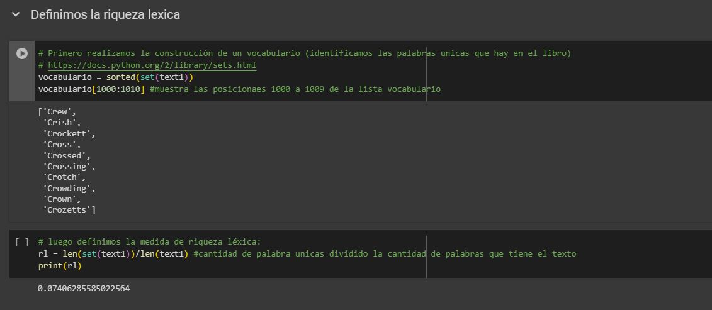
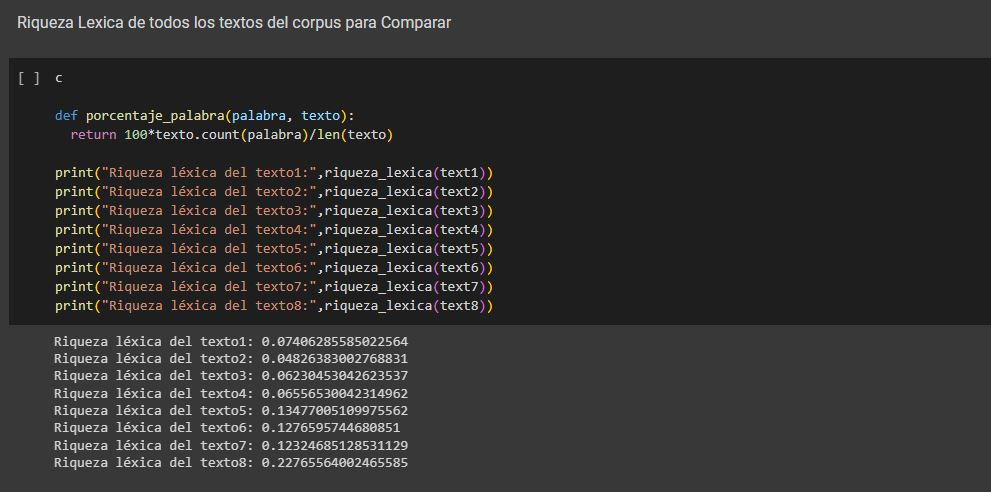
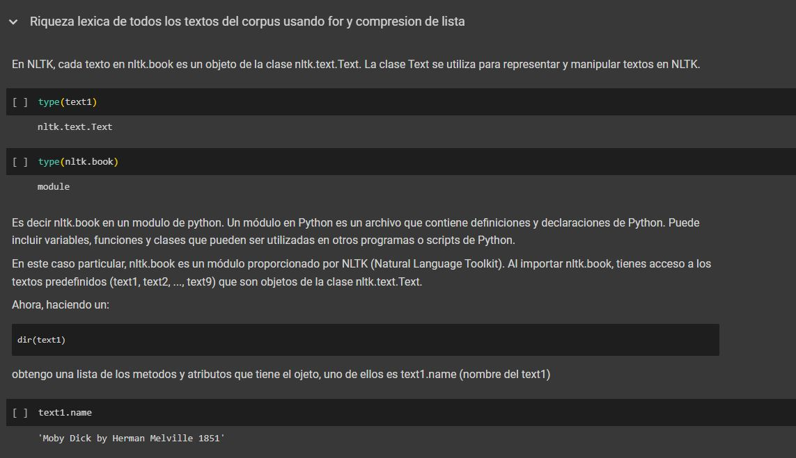
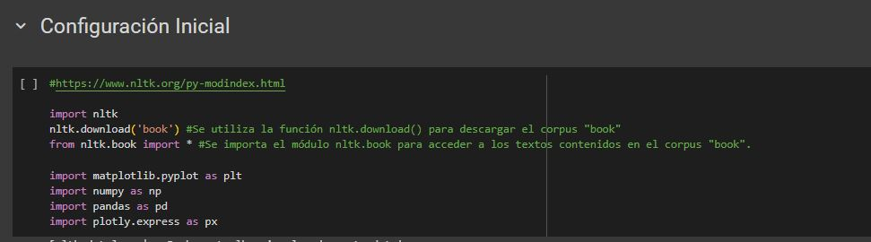
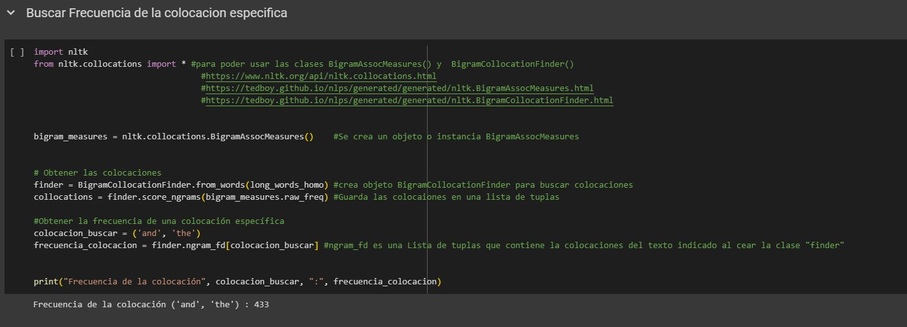
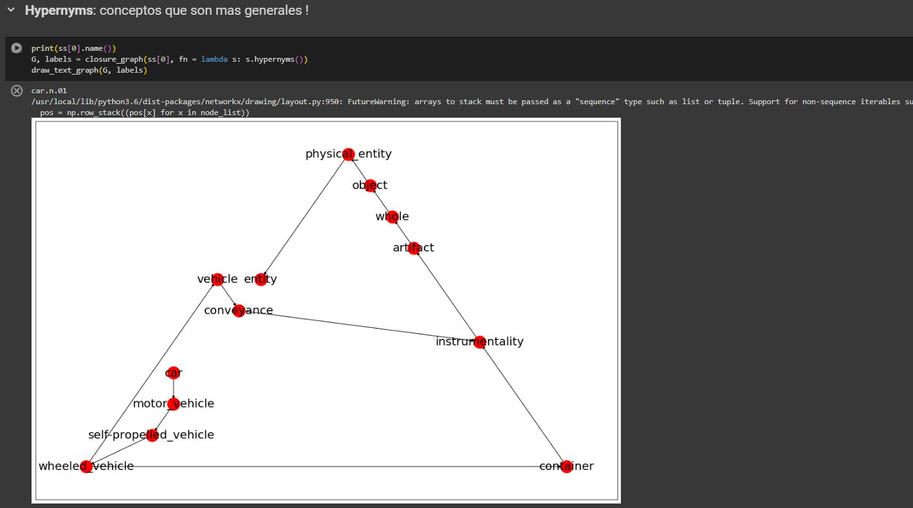
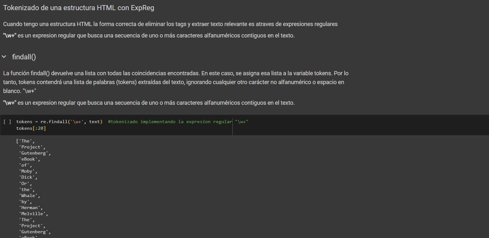
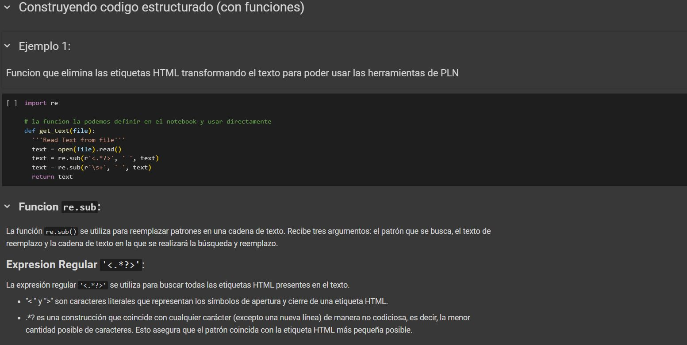
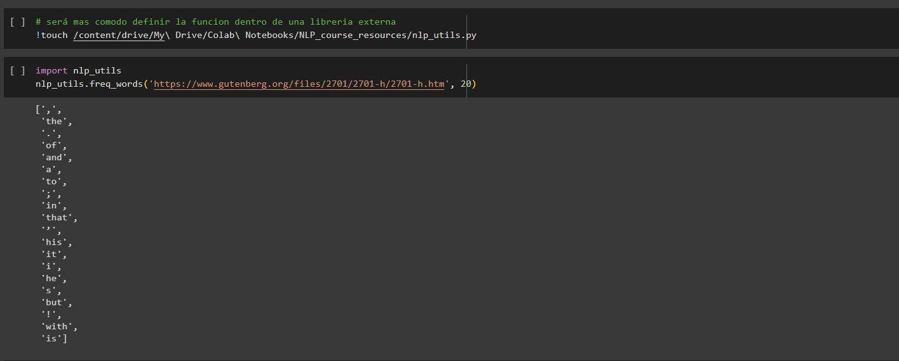

# Curso de Fundamentos de Procesamiento de Lenguaje Natural con Python y NLTK

Recordatorio principales tipos de datos en Python:

1-Listas: Secuencia ordenada y modificable de elementos, representada con corchetes []. Permite duplicados y acceso mediante índices.

2-Tuplas: Secuencia ordenada e inmutable de elementos, representada con paréntesis (). No se pueden modificar después de la creación.

3-Conjuntos: Colección desordenada de elementos únicos, representada con llaves {}. No permite duplicados.

4-Diccionarios: Colección de pares clave-valor, representada con llaves {}. Permite acceso a los valores mediante claves únicas.

5-Cadenas de texto: Secuencia inmutable de caracteres, representada con comillas simples o dobles. Se utilizan para almacenar texto.


- [Curso de Fundamentos de Procesamiento de Lenguaje Natural con Python y NLTK](#curso-de-fundamentos-de-procesamiento-de-lenguaje-natural-con-python-y-nltk)
  - [Modulo 1 Introducción al Procesamiento de Lenguaje Natural](#modulo-1-introducción-al-procesamiento-de-lenguaje-natural)
    - [Clase 1 Introducción al Procesamiento de Lenguaje Natural](#clase-1-introducción-al-procesamiento-de-lenguaje-natural)
      - [Introduccion al NLP: Perspectivas y estado del arte](#introduccion-al-nlp-perspectivas-y-estado-del-arte)
      - [NLP es el camino hacia el ideal de I.A.](#nlp-es-el-camino-hacia-el-ideal-de-ia)
      - [NLP y el Estado del Arte](#nlp-y-el-estado-del-arte)
    - [Clase 2 Evolucion del NLP](#clase-2-evolucion-del-nlp)
    - [Clase 3 Conceptos básicos de NLP](#clase-3-conceptos-básicos-de-nlp)
  - [Modulo 2 Fundamentos con NLTK](#modulo-2-fundamentos-con-nltk)
    - [Clase 4 Configurar ambiente de trabajo](#clase-4-configurar-ambiente-de-trabajo)
    - [Clase 5 Palabras, textos y vocabularios](#clase-5-palabras-textos-y-vocabularios)
    - [Clase 6 Tokenizacion con Expresiones Regulares](#clase-6-tokenizacion-con-expresiones-regulares)
    - [Clase 7 Estadisticas basicas del lenguaje](#clase-7-estadisticas-basicas-del-lenguaje)
    - [Clase 8 Distribuciónes de frecuencia de palabras](#clase-8-distribuciónes-de-frecuencia-de-palabras)
    - [Clase 9 Refinamiento y visualización de cuerpos de texto](#clase-9-refinamiento-y-visualización-de-cuerpos-de-texto)
    - [Clase 10 N-gramas y Colocaciones del lenguaje](#clase-10-n-gramas-y-colocaciones-del-lenguaje)
      - [N-gramas](#n-gramas)
      - [Colocaciones](#colocaciones)
    - [Clase 11 Como extraer n-gramas de un texto en Python](#clase-11-como-extraer-n-gramas-de-un-texto-en-python)
    - [Clase 12 Colocaciones en Python](#clase-12-colocaciones-en-python)
    - [Clase 13 Colocaciones en gráficos de dispersion](#clase-13-colocaciones-en-gráficos-de-dispersion)
    - [Clase 14 Filtros y colocaciones en NLTK](#clase-14-filtros-y-colocaciones-en-nltk)
    - [Clase 15 Introduccion a los recursos lexicos](#clase-15-introduccion-a-los-recursos-lexicos)
    - [Clase 16 Recursos lexicos en NLTK](#clase-16-recursos-lexicos-en-nltk)
    - [Clase 17 NLTK para traduccion de palabras](#clase-17-nltk-para-traduccion-de-palabras)
    - [Clase 18 Introduccion a WordNet](#clase-18-introduccion-a-wordnet)
    - [Clase 19 Explorando WordNet](#clase-19-explorando-wordnet)
    - [Clase 20 Similitud Semantica con WordNet](#clase-20-similitud-semantica-con-wordnet)
    - [Clase 21 Procesamiento de texto plano desde Web](#clase-21-procesamiento-de-texto-plano-desde-web)
    - [Clase 22 Usando codigo estructurado: conexión de Drive a Google Colab](#clase-22-usando-codigo-estructurado-conexión-de-drive-a-google-colab)
    - [Clase 23 Usando codigo estructurado: Funciones externas](#clase-23-usando-codigo-estructurado-funciones-externas)
    - [Recursos adicionales](#recursos-adicionales)

## Modulo 1 Introducción al Procesamiento de Lenguaje Natural

### Clase 1 Introducción al Procesamiento de Lenguaje Natural

#### Introduccion al NLP: Perspectivas y estado del arte

#### NLP es el camino hacia el ideal de I.A.

Antes de iniciar debemos comprender dos definiciones:

**NLP:** Natural Language Processing

**NLU:** Natural Language Understanding

NLP es un area que combina lo siguiente:

- Ciencias de la computación
- Inteligencia Artificial
- Lenguajes de Programación

Esto para entender como se dan las interacciones entre humanos y maquinas a traves del language natural que usamos los humanos para comunicarnos, dentro de esta area esta el NLU como un area mas pequeña que se encarga de tareas especificas que las maquinas puedan ejecutar en el proceso de comunicación con los seres humanos de manera que esas tareas reflejen que el robot no solo puede procesar nuestro lenguaje sino también lo puede entender, y en la medida que nos da respuestas, esas respuestas deben reflejar la comprensión que tiene de nuestro lenguaje


#### NLP y el Estado del Arte


¿Pero por que es tan difícil esta area?

Simple, los algoritmos no tienen el contexto que los humanos tenemos, ya que nuestro lenguaje es ambiguo y difuso

### Clase 2 Evolucion del NLP


**Sistemas basados en reglas:** como su nombre lo indica a las maquinas se les pre-programaba las reglas para generar conversación basado en todas nuestras reglas y conocimiento lingüístico dl lenguaje, esto fue un paradigma predominante hasta los años 90.

**Estadística de corpus** En los 90's comenzamos a utilizar estadísticos, aquí hablamos de algoritmos basados en estadísticos de corpus, un corpus es una colección de diferentes textos, imagina que tomamos todos los textos de todas las webs y hacemos una colección con todo eso para entrenar un algoritmo que mediante estadística aprende la distribución de probabilidad entre las palabras y usando eso puede aprender a construir frases que tengan un sentido gramatical similar al nuestro cuando hablamos o escribimos.

Actualmente los avances se dividen como sigue:


El aprendizaje de representaciones hace uso de algoritmos basados en redes neuronales (deep learning) multitasking con el concepto matemático de representación, hace uso de la vectorizacion de las palabras y frases para denotar relación semántica.

**Representacion Vectorial de Palabras**

la representación vectorial de palabras, también conocida como word embeddings, es una técnica utilizada en el Procesamiento del Lenguaje Natural (PLN) para representar palabras como vectores numéricos en un espacio multidimensional.

La idea básica detrás de estos modelos es que las palabras que aparecen en contextos similares tienden a tener significados similares.

**Los avances mas recientes en el aprendizaje de representaciones**.


Las redes transformer y reformer son nuevas relativamente (2018)

**Tecnica de Los Mecanismos de Atencion**

Los mecanismos de atención son una técnica utilizada en el Procesamiento del Lenguaje Natural (PLN) para procesar texto y asignar diferentes niveles de importancia o atención a partes específicas del texto. Estos mecanismos se inspiran en el funcionamiento del sistema de atención humano y se utilizan para mejorar el rendimiento de los modelos de PLN en diversas tareas, como traducción automática, generación de texto y comprensión del lenguaje.

En el contexto del procesamiento de texto, los mecanismos de atención permiten que un modelo se enfoque en partes relevantes del texto mientras realiza una tarea específica. En lugar de procesar todo el texto de manera uniforme, el modelo puede asignar diferentes pesos o valores de atención a las diferentes palabras o partes del texto en función de su relevancia para la tarea en cuestión.


**LIBRERIA NLTK**

NLTK (Natural Language Toolkit) es una librería popular de Python para el Procesamiento del Lenguaje Natural (PLN). Proporciona una amplia gama de herramientas y recursos que permiten a los desarrolladores trabajar con datos de texto y realizar diversas tareas de PLN.

Algunas de las características y funcionalidades proporcionadas por NLTK incluyen:


Preprocesamiento de texto: NLTK ofrece una variedad de funciones para limpiar y preprocesar datos de texto, como tokenización (dividir el texto en palabras o frases), eliminación de stopwords (palabras comunes que no aportan mucho significado), eliminación de puntuación, lematización y stemming (reducción de palabras a su forma base).


Modelos y corpus: NLTK incluye una amplia colección de corpus preexistentes, que son conjuntos de datos etiquetados y anotados en diferentes idiomas y dominios. También proporciona herramientas para construir y entrenar modelos de PLN, como modelos de lenguaje, clasificadores de texto y etiquetadores gramaticales.


Análisis sintáctico y semántico: NLTK cuenta con herramientas para realizar análisis sintáctico, como etiquetado gramatical (POS tagging), análisis de dependencias y extracción de frases. También ofrece funcionalidades para realizar análisis semántico, como detección de entidades nombradas y resolución de correferencias.


WordNet: NLTK incluye una implementación de WordNet, una base de datos léxica que proporciona sinónimos, antónimos y relaciones semánticas entre palabras en inglés. WordNet es útil para tareas como la desambiguación de sentidos y la expansión de consultas de búsqueda.


Procesamiento de texto en otros idiomas: NLTK admite el procesamiento de texto en varios idiomas, con recursos y herramientas específicas disponibles para diferentes lenguajes.

**LIBRERIA spaCY**


SpaCy es otra popular librería de procesamiento del lenguaje natural (PLN) en Python. Se destaca por su enfoque en la eficiencia, la velocidad y el rendimiento, lo que la convierte en una opción popular para aplicaciones de PLN en producción.


### Clase 3 Conceptos básicos de NLP


**NLP:** El procesamiento de lenguaje natural esta más enfocado hacia aplicaciones practicas en la ingeniería

**LC :** La lingüística computacional estudia el lenguaje desde una perspectiva más científica, responde a las preguntas que y como computan las personas. (Basada en crear modelos que pueden tener dos enfoques de conocimiento o datos)

Para nosotros el procesamiento de texto todo texto es el siguiente.


El procesamiento de una cadena de texto necesita una Normalización.

**Normalización:** Básicamente consiste en procesos de limpieza y transformación de los cuales son Tokenization, Lematización y Segmentación (a nivel de frases)

**Tokenización:** Separar en palabras toda la cadena de texto en tokens o unidades mínimas lingüísticas, estas frecuentemente se asocia con separar en palabras


**Lematización:** Convertir cada una de las palabras o tokens de una frase o una cadena de texto a su raíz fundamental, es decir si tu tienes una palabra o un verbo lo que haces es convertirla a la palabra original de la cual se derivo esa conjugacion.


**Segmentación:** Separación en frases (puede ser con las comas), el problema es que esta regla no siempre se aplica y por ello no siempre es están sencillo como parece.


Ahora que tenemos claro el funnel básico de procesamiento de texto (o normalizacion de texto), esto lo queremos aplicar sobre una colección de muchos textos, porque si queremos construir unn algoritmo de estadística basada en corpus, lo que tenemos que hacer es recoger un dataset o un conjunto de datos con muchos textos, y a esa colección es lo que le llamamos un corpus.

**CORPUS:** Colección de muchos textos


**CORPORA:** Colección de colecciones de texto


## Modulo 2 Fundamentos con NLTK

### Clase 4 Configurar ambiente de trabajo

Esta clase explica brevemente el uso de nltk con Google Collab, en esta sección vamos a importar nltk, descargar un corpus y guardarlo en formato flatten.


### Expresiones Regulares
Las expresiones regulares, también conocidas como regex o regexp, son secuencias de caracteres que definen un patrón de búsqueda. Son ampliamente utilizadas en programación para realizar operaciones de búsqueda, manipulación y validación de cadenas de texto.

Las expresiones regulares están compuestas por caracteres literales y metacaracteres. Los caracteres literales representan caracteres que se buscan de manera literal, mientras que los metacaracteres tienen un significado especial y se utilizan para realizar operaciones más complejas.

Algunos ejemplos de operaciones comunes que se pueden realizar con expresiones regulares son:

  - Coincidencia de patrones: Las expresiones regulares se utilizan para buscar patrones específicos dentro de una cadena de texto. Por ejemplo, se puede buscar un número de teléfono con un patrón específico en un texto largo.
  - Extracción de información: Las expresiones regulares se pueden utilizar para extraer partes específicas de una cadena de texto. Por ejemplo, se puede extraer el dominio de un correo electrónico o el código postal de una dirección.
  - Validación de formatos: Las expresiones regulares permiten validar si una cadena de texto cumple con un formato específico. Por ejemplo, se puede verificar si una dirección de correo electrónico tiene el formato adecuado.
   - Sustitución de texto: Las expresiones regulares se pueden utilizar para reemplazar partes de una cadena de texto con otro texto. Por ejemplo, se puede reemplazar todas las ocurrencias de una palabra por otra palabra en un documento.


### Clase 5 Palabras, textos y vocabularios

Retomando la clase anterior usaremos expresiones regulares con la funcion re.search() para encontrar patrones en de texto contenidos en la variable flatten.


Profundiza con el curso de expresiones regulares.

### Clase 6 Tokenizacion con Expresiones Regulares

Esta clase usa regex para Tokenizar frases simples, y nltk.regexp_tokenize(texto, pattern) para enfrentar textos mas complejos.

#### Expresiones Regulares
Son patrones para buscar cadenas de texto en un corpus


### Clase 7 Estadisticas basicas del lenguaje

Para este ejercicio utilizaremos un nuevo notebook, usaremos el corpus books el cual contiene una gran cantidad de libros, accedemos a ellos instanciando los y usando la variable text1, text2, etc.

Haremos operaciones sencillas y obtendremos la riqueza léxica del texto.







### Clase 8 Distribuciónes de frecuencia de palabras

En esta clase vamos a calcular estadísticas basadas en la frecuencia de aparición o numero de aparición de palabras en un texto, cuando hacemos esta operación sobre todas las palabras que componen el vocabulario de un texto construimos una distribución de probabilidad de esas palabras dentro del texto.


### Clase 9 Refinamiento y visualización de cuerpos de texto

Continuaremos trabajando con distribuciones de frecuencia de aparición de palabras en un texto.


### Clase 10 N-gramas y Colocaciones del lenguaje

En esta clase continuamos obteniendo estadisticas sobre un texto, esta vez sobre estructuras mas complejas,vamos a trabajar dos conceptos fundamentales:

#### N-gramas

Los N-gramas son secuencias de n palabras consecutivas, observa los siguientes ejemplos.

Bi-gramas (2 palabras consecutivas)


Tri-gramas (3 palabras consecutivas)


#### Colocaciones


En este ejemplo puedes observar en el recuadro dos sentencias que significan algo similar, sin embargo por razones mas allá del lenguaje la primera es mas usada que la segunda. En el ejemplo en azul vemos una expresión usual en Latam pero realmente no hay razón gramatical para usar estas dos palabras juntas, pero por razones culturales esta frase existe.

### Clase 11 Como extraer n-gramas de un texto en Python

En esta clase aplicamos los conceptos anteriores n-gramas y colocaciones, aquí vamos a ver que estadisticamente podemos identificar estas colocaciones por medio del uso de n-gramas, ya que una colocación no es necesariamente una palabra exclusiva sino un conjunto de palabras  sino 2,3, o más que también reflejan la influencia cultural en ciertos usos del lenguaje.




Hecho esto ya tenemos los conocimientos para la obtención y calculo de n-gramas usando las herramientas de nltk, la idea de trabajar con estas estructuras para nuestro caso inicial es identificar colocaciones de lenguaje aplicando métricas basadas en los n-gramas, pero esto tiene muchas aplicaciones, en general los n-gramas son la base de muchos algoritmos de procesamiento de lenguaje natural que tiene aplicaciones diversas en el mundo real, por ejemplo clasificación de texto, del habla, traducción, algoritmos de aprendizaje de embebimiento para vectores de palabras o de frases y esto tiene alcance incluso en el area de deep learning, estas tareas serán rutinarias y la base antes de construir algoritmos más sofisticados, por ejemplo si quieres construir una nube de palabras de lo que una persona dice sobre una marca o una persona los n-gramas son la solución más sencilla a la hora de implementar esto.

### Clase 12 Colocaciones en Python

En esta clase trabajaremos con los n-gramas calculados anteriormente, introduciremos estadística y métricas nuevas para calcular las colocaciones, recordemos que estas son ocurrencias de **palabras** en textos o conversaciones que tienen **frecuencias inusualmente altas**, existe evidencia estadística y científica de la alta frecuencia de ocurrencia de las colocaciones, lo que nos permitirá crear algoritmos para detectar estas.


El DataFrame inferimos que los valores mas cercanos a cero son aquellos que son propensos a ser Colocaciones de lenguaje.

### Clase 13 Colocaciones en gráficos de dispersion

En esta clase analizamos a detalle los resultados del DataFrame


### Clase 14 Filtros y colocaciones en NLTK

En la clase anterior trabajamos en una visualización interactiva que nos permitía identificar hasta cierto punto bi-gramas que tenían una alta probabilidad de ser colocaciones aquí vamos a ver como este proceso se puede realizar con NLTK sin el uso de visualizaciones y de una forma mucho más rápida.





### Clase 15 Introduccion a los recursos lexicos

**¿Que es un recuso léxico?**

Es una colección de palabras o frases que puede o no contener metadatos acerca de los elementos de esa colección.

**¿Por que es importante esto?**

En lenguajes como el español, hay palabras que pueden tener diferentes significados

**¿Cómo podemos en nuestro procesamiento del lenguaje en las diferentes tareas que se deben ejecutar?**

Dependiendo del contexto en que esa palabra sea usada, y esa información se puede estructurar y categorizar en lo que llamamos un recurso léxico o un lexicon.

**Ejemplo lexicon**.


### Clase 16 Recursos lexicos en NLTK

En esta clase trabajaremos sobre Google Collab, y vamos a trabajar en mas detalle sobre recursos lexicos, sus tipos y casos de uso.


### Clase 17 NLTK para traduccion de palabras


### Clase 18 Introduccion a WordNet

En esta clase continuamos trabajando con recursos lexicos como herramientas de ayuda para el procesamiento del lenguaje natural, WordNet fue uno de los recursos con mas auge y mas uso en diferentes tareas de procesamiento, esta era una base de datos de caracter léxico para le idioma ingles, aunque el deep learning lo ha desplazado.


### Clase 19 Explorando WordNet




### Clase 20 Similitud Semantica con WordNet

Ahora que hemos aprendido los recursos de este lexicon tan importante que es wordnet vamos a construir una manera sencilla para medir distancia basada en similitud semantica con base en los synsets o conceptos de sinónimos que están asociados a esas palabra a las cuales yo quiero calcularles esa medida de distancia.


 
### Clase 21 Procesamiento de texto plano desde Web

Hasta este punto utilizamos textos estructurados, ahora utilizaremos nuevas herramientas extraer texto plano de la web y pre-procesarlo antes de aplicar todo lo aprendido previamente.





### Clase 22 Usando codigo estructurado: conexión de Drive a Google Colab

En esta clase vamos a enfocarnos en el codigo, escribiremos funciones estructuradas y un pipeline completo en Collab.


### Clase 23 Usando codigo estructurado: Funciones externas

En el mismo path que los archivos del curso creo read.py

```py
def get_text(file):
    text = open(file).read()
    text = re.sub(r'<.*?>', ' ', text)
    text = re.sub(r'\s+>', ' ', text)
    return text
```

Y posterior se importará en collab






### Recursos adicionales

<https://www.nltk.org/howto/collocations.html>

<https://www.nltk.org/_modules/nltk/metrics/association.html>